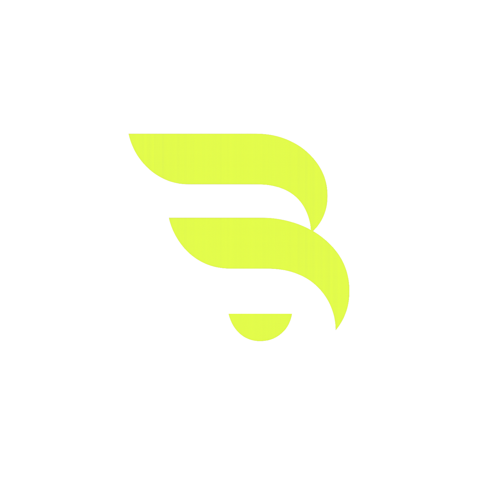

<div align="center">



# Bastion

**Autonomous, verifiable AI fund for tokenized stocks on Robinhood Chain.**

A swarm of AI agents that researches, debates, sizes and executes — then proves every trade on-chain. Non-custodial. Proven, not trusted.

[](LICENSE)
[](../../actions)
[](../../releases)
[](tsconfig.json)

[](../../stargazers)
[](../../commits)
[](../../issues)

[Website](https://bastionfund.vercel.app) · [Architecture](docs/architecture.md) · [Verifiable Reasoning](docs/verifiable-reasoning.md) · [Changelog](CHANGELOG.md)

</div>

---

> **Auditable beats autonomous.** An agent that cannot show its evidence trail is a demo, not infrastructure.

## What is Bastion?

Robinhood Chain put tokenized US stocks (NVDA, AAPL, GOOG…) on-chain and made them tradable 24/7 — but there is no autonomous, accountable way to trade them. Bastion is that layer: a council of specialised AI agents that reasons over the on-chain oracle, votes on every position under a hard risk kernel, and anchors a cryptographic proof of *why* it traded on Robinhood Chain. Keys stay on your machine. The proof is the product.

## Quick Start

```bash
# one-line install (macOS / Linux)
curl -fsSL https://bastiontrade.xyz/install.sh | bash

# or build the native binary directly
cargo install --git https://github.com/adrydevel/bastion-rs bastion-rs

# run one research -> debate -> verdict -> proof pass
bastion run --ticker NVDA
```

Reasoning runs on [Nous Research](https://nousresearch.com) **Hermes** by default (open-weights, OpenAI-compatible). Point `BASTION_BASE_URL` / `BASTION_API_KEY` at any compatible endpoint to swap it.

## Features

| Layer | What it does |
|-------|--------------|
| **Agent Swarm** | Five agents — Analyst · Sentiment · Risk · Contrarian · Executor — opine independently, then a quorum vote decides. No single agent moves capital. |
| **Risk Kernel** | Fractional-Kelly sizing, CVaR tail cap, drawdown circuit-breaker. Deterministic and inspectable. |
| **Regime + Bandit** | Classifies trend / chop / high-vol and reallocates strategies via Thompson sampling. |
| **Reflexive Memory** | Recalls similar past states and post-mortems, feeds them back into the next decision. |
| **Verifiable Reasoning** | `keccak256` of the full decision, anchored on Robinhood Chain — tamper-evident, TEE-signed in the hosted tier. |
| **Robinhood Chain native** | Reads NAV from the Chainlink oracle; executes tokenized stocks 24/7. |

## Architecture

```
oracle quote ─▶ regime detector ─▶ council debate ─▶ risk kernel ─▶ proof ─▶ execute
                     │                   │                │            │
                  bandit            5 agents         Kelly/CVaR    keccak256
                 (strategy)        quorum vote      circuit-break   + anchor
```

Full write-up in [docs/architecture.md](docs/architecture.md).

## Tech Stack

- **Runtime** — Node 20+, TypeScript (strict)
- **Chain** — viem, Robinhood Chain (Arbitrum Orbit L2), Chainlink oracle
- **Reasoning** — Nous Research Hermes via OpenAI-compatible client
- **Proof** — keccak256 attestation, on-chain anchoring

## Roadmap

- [x] Council + quorum voting
- [x] Risk kernel (Kelly / CVaR / drawdown breaker)
- [x] Regime detection + bandit allocation
- [x] Reflexive memory
- [x] On-chain proof anchoring
- [ ] TEE-signed attestation (hosted runtime)
- [ ] Backtest harness against historical oracle series
- [ ] Multi-book portfolio allocation

## Contributing

Contributions welcome — read [CONTRIBUTING.md](CONTRIBUTING.md) first.

## Support the Project

If you find this useful, consider supporting the open-source work.

[](https://buymeacoffee.com/adrydevel)

## License

[](LICENSE)

---

<div align="center">

**Building agent infrastructure or autonomous trading systems?**

Bastion ships as open source — the hosted, TEE-signed runtime is in private beta.

[bastionfund.vercel.app](https://bastionfund.vercel.app)

</div>

---
## Status

Alpha. APIs may change before v1.0. Run `bastion run` to try the demo pass.
